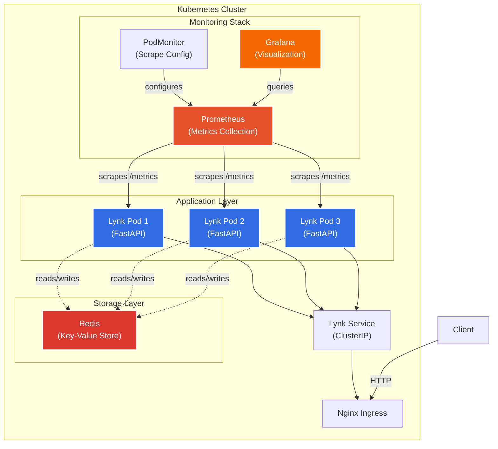
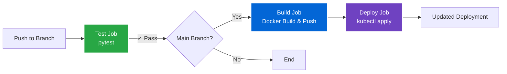

# Lynk - URL Shortening Service

A production-ready URL shortening service built to demonstrate cloud-native application development with Kubernetes observability using Prometheus and Grafana.

## Overview

Lynk is a FastAPI-based URL shortener deployed on Kubernetes with comprehensive monitoring capabilities. This project was developed as a learning exercise to understand modern DevOps practices, specifically focusing on metrics collection, visualization, and CI/CD automation.

## Architecture



## Technology Stack

- **Application**: FastAPI, Python 3.11
- **Storage**: Redis 7
- **Container**: Docker
- **Orchestration**: Kubernetes (Minikube for local development)
- **Monitoring**: Prometheus, Grafana (kube-prometheus-stack)
- **Metrics**: prometheus-fastapi-instrumentator, prometheus-client
- **CI/CD**: GitHub Actions
- **Testing**: pytest, httpx

## Features

- Generate short codes (6-character alphanumeric)
- Redirect short URLs to original destinations
- Health check endpoint
- Prometheus metrics exposure with custom counters:
  - Total URLs shortened
  - Total redirects
  - 404 rate
  - Request latency (p95, p99)
- Comprehensive test suite
- Automated Docker builds and deployments

## Prerequisites

- Python 3.11+
- Docker
- Kubernetes (Minikube)
- Helm 3
- kubectl
- GitHub account (for CI/CD)
- Docker Hub account (for image registry)

## Local Development

### Setup

```bash
# Clone repository
git clone https://github.com/yourusername/lynk.git
cd lynk

# Create virtual environment
python -m venv venv
source venv/bin/activate  # On Windows: venv\Scripts\activate

# Install dependencies
pip install -r requirements.txt
```

### Run with Docker Compose

```bash
# Start application and Redis
docker compose up

# Application available at http://localhost:8000
# API docs at http://localhost:8000/docs
```

### Run Tests

```bash
# Activate virtual environment
source venv/bin/activate

# Run test suite
pytest tests/ -v
```

## Kubernetes Deployment

### Initial Setup

```bash
# Start Minikube
minikube start

# Enable required addons
minikube addons enable ingress
minikube addons enable metrics-server

# Deploy application
kubectl apply -f k8s/

# Verify deployment
kubectl get pods
kubectl get svc
```

### Monitoring Stack Setup

```bash
# Add Helm repositories
helm repo add prometheus-community https://prometheus-community.github.io/helm-charts
helm repo update

# Install Prometheus and Grafana
helm install prometheus prometheus-community/kube-prometheus-stack \
  --set prometheus.prometheusSpec.serviceMonitorSelectorNilUsesHelmValues=false \
  --set prometheus.prometheusSpec.podMonitorSelectorNilUsesHelmValues=false

# Wait for pods to be ready
kubectl get pods -w

# Get Grafana admin password
kubectl get secret prometheus-grafana -o jsonpath="{.data.admin-password}" | base64 -d ; echo
```

### Access Services

```bash
# Port forward Lynk application
kubectl port-forward svc/lynk 8080:80

# Port forward Grafana
kubectl port-forward svc/prometheus-grafana 3000:80

# Port forward Prometheus (optional)
kubectl port-forward svc/prometheus-kube-prometheus-prometheus 9090:9090
```

- **Application**: http://localhost:8080
- **Grafana**: http://localhost:3000 (admin / <password-from-secret>)
- **Prometheus**: http://localhost:9090

### Grafana Dashboard Setup

1. Login to Grafana at http://localhost:3000
2. Navigate to Dashboards → Import
3. Upload `grafana-dashboard.json` from repository
4. Dashboard includes:
   - Request rate (redirects/sec)
   - URL shortening rate
   - 404 error rate
   - P95 request latency

Alternatively, create panels manually with these queries:

```promql
# Redirects per second
rate(lynk_urls_redirected_total[5m])

# URLs shortened per second
rate(lynk_urls_shortened_total[5m])

# 404 rate
rate(lynk_urls_not_found_total[5m])

# P95 latency
histogram_quantile(0.95, sum(rate(http_request_duration_seconds_bucket[5m])) by (le))
```

## API Usage

### Shorten URL

```bash
curl -X POST http://localhost:8080/shorten \
  -H "Content-Type: application/json" \
  -d '{"url":"https://example.com"}'

# Response:
# {"short_code":"abc123","short_url":"http://localhost:8000/abc123"}
```

### Redirect

```bash
curl http://localhost:8080/abc123
# Redirects to https://example.com
```

### Health Check

```bash
curl http://localhost:8080/health
# Response: {"status":"healthy"}
```

### Metrics

```bash
curl http://localhost:8080/metrics
# Returns Prometheus-formatted metrics
```

## CI/CD Pipeline

The project includes a GitHub Actions workflow that runs on every push:



### Workflow Jobs

1. **Test**: Runs pytest on all branches
2. **Build**: Builds Docker image and pushes to Docker Hub (main branch only)
3. **Deploy**: Placeholder for deployment automation (currently manual)

### Setup GitHub Secrets

Configure in repository Settings → Secrets and variables → Actions:

- `DOCKERHUB_USERNAME`: Your Docker Hub username
- `DOCKERHUB_TOKEN`: Access token from Docker Hub

After merge to main, manually update deployment:

```bash
# Pull latest image
kubectl set image deployment/lynk lynk=tievenr/lynk:latest

# Verify rollout
kubectl rollout status deployment/lynk
```

## Project Structure

```
lynk/
├── app/
│   ├── __init__.py
│   ├── main.py          # FastAPI application entry point
│   ├── routes.py        # API endpoints and request handlers
│   └── store.py         # Redis storage layer
├── tests/
│   ├── __init__.py
│   ├── conftest.py      # pytest fixtures
│   └── test_routes.py   # API endpoint tests
├── k8s/
│   ├── deployment.yaml         # Lynk application deployment
│   ├── service.yaml            # ClusterIP service
│   ├── ingress.yaml            # Ingress configuration
│   ├── redis-deployment.yaml   # Redis deployment
│   ├── redis-service.yaml      # Redis service
│   └── podmonitor.yaml         # Prometheus PodMonitor
├── .github/
│   └── workflows/
│       └── deploy.yml          # CI/CD pipeline
├── Dockerfile                   # Container image definition
├── docker-compose.yml          # Local development setup
├── requirements.txt            # Python dependencies
├── grafana-dashboard.json      # Pre-configured dashboard
└── README.md
```

## Configuration

### Environment Variables

- `REDIS_HOST`: Redis hostname (default: `redis`)
- `BASE_URL`: Base URL for short links (default: `http://localhost:8000`)

### Kubernetes ConfigMap (Optional)

```yaml
apiVersion: v1
kind: ConfigMap
metadata:
  name: lynk-config
data:
  REDIS_HOST: redis
  BASE_URL: http://your-domain.com
```

## Monitoring and Observability

### Metrics Exposed

The application exposes Prometheus metrics at `/metrics`:

- `lynk_urls_shortened_total`: Counter for total URLs shortened
- `lynk_urls_redirected_total`: Counter for successful redirects
- `lynk_urls_not_found_total`: Counter for 404 errors
- `http_request_duration_seconds`: Histogram of request latencies
- `http_requests_total`: Total HTTP requests by method and path

### Prometheus Targets

Verify metrics collection:

```bash
kubectl port-forward svc/prometheus-kube-prometheus-prometheus 9090:9090
```

Navigate to http://localhost:9090/targets and find `podMonitor/default/lynk` with UP status.

## Troubleshooting

### Pods not starting

```bash
kubectl describe pod <pod-name>
kubectl logs <pod-name>
```

### Metrics not appearing in Grafana

```bash
# Check Prometheus targets
kubectl port-forward svc/prometheus-kube-prometheus-prometheus 9090:9090
# Visit http://localhost:9090/targets

# Verify metrics endpoint
kubectl port-forward svc/lynk 8080:80
curl http://localhost:8080/metrics
```

### Redis connection issues

```bash
# Check Redis pod status
kubectl get pods -l app=redis

# Test Redis connectivity from Lynk pod
kubectl exec -it <lynk-pod-name> -- redis-cli -h redis ping
```

## Learning Outcomes

This project demonstrates:

- RESTful API design with FastAPI
- Container orchestration with Kubernetes
- Metrics instrumentation with Prometheus
- Data visualization with Grafana
- CI/CD automation with GitHub Actions
- Infrastructure as Code with Kubernetes manifests
- Testing strategies for microservices
- Load balancing with Kubernetes Services
- Service discovery and networking

## Future Enhancements

- Implement TTL (time-to-live) for shortened URLs
- Add rate limiting per IP address
- Custom short codes (vanity URLs)
- Analytics dashboard for URL statistics
- URL validation and safety checks
- API authentication and authorization
- Horizontal Pod Autoscaling based on metrics
- Multi-region deployment with geo-routing

## License

MIT License - See LICENSE file for details

## Author

Created as a learning project to explore Kubernetes observability patterns with Prometheus and Grafana.
